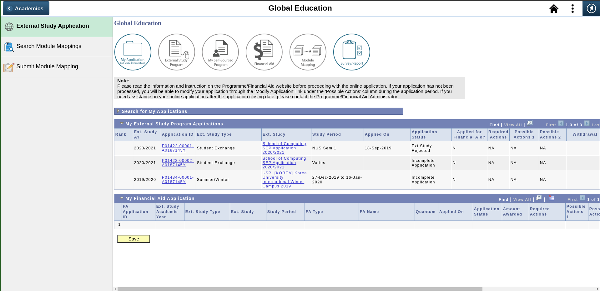
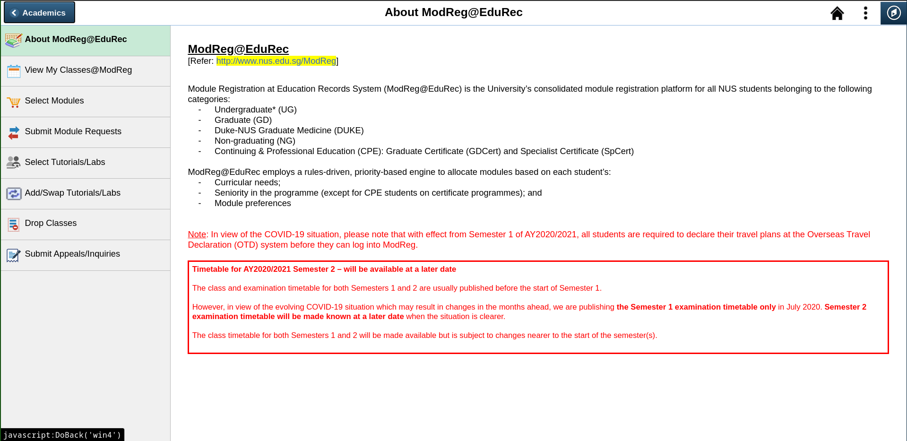

# CS3240 Lab 3

This is a redesign of NUS' administrative website, EduRec, for CS3240 Interaction Design, Lab 3.

## Sitemap

* [Home Page](/landing.html)
* [About Page](/about.html)
* [Global Education Page](/global_education.html)
* [ModReg Page](/modreg.html) 

## Lab Overview

For this lab we were tasked to construct a working website based on the website chosen for our previous lab, where we had to create
high fidelity prototypes for our website designs on figma. 

[Link to Figma Prototype](https://www.figma.com/proto/FMun6ppVlsUrE6L2RoGAiM/CS3240-Assignment-2?node-id=2%3A2&scaling=scale-down)

I decided to choose EduRec as it was an important administrative website for all NUS students. 
Despite its importance, for some reason the website was poorly designed and buggy. 

### Constraints

I did not use any static site generator to create these pages due to time constraints. 

We were not allowed to use any additional runtime environments, JS libraries or pre-processors such as node or react, except for jQuery. 

## Original Design of EduRec

### Landing Page

### Global Education Page

### ModReg Page
